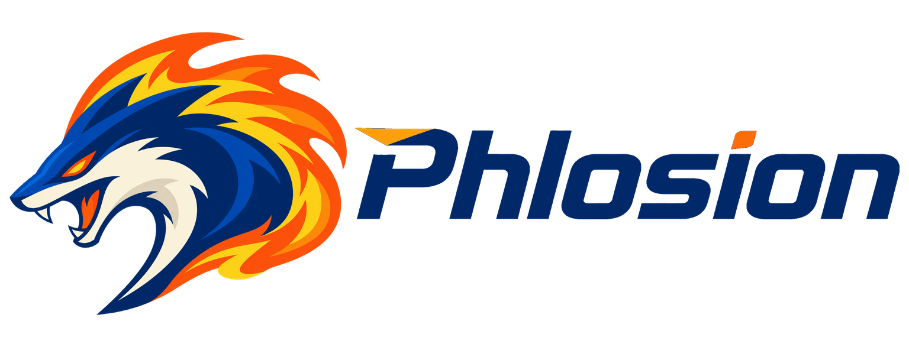
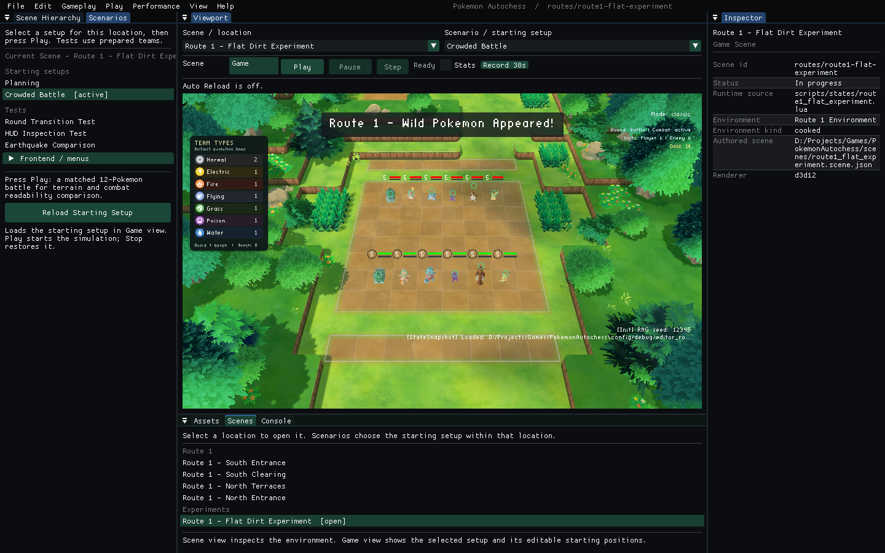

<p align="center">
  <a href="https://phlosion.com/">
    <picture>
      <source media="(prefers-color-scheme: dark)" srcset="docs/assets/readme/phlosion-lockup-cream.png">
      <source media="(prefers-color-scheme: light)" srcset="docs/assets/readme/phlosion-lockup-blue.png">
      
    </picture>
  </a>
</p>

<h1 align="center">Phlosion Engine</h1>

<p align="center">
  A reusable C++20 game engine and native editor.<br>
  Three graphics APIs, shared runtime services, and explicit project extension boundaries.
</p>

<p align="center">
  <a href="https://isocpp.org/"></a>
  <a href="https://wiki.libsdl.org/SDL2/FrontPage"></a>
  <a href="https://github.com/ocornut/imgui"></a>
  <a href="https://www.lua.org/manual/5.4/"></a>
  <a href="https://cmake.org/"></a>
  <a href="https://vcpkg.io/"></a>
  <br>
  <a href="https://www.opengl.org/"></a>
  <a href="https://www.vulkan.org/"></a>
  <a href="https://learn.microsoft.com/en-us/windows/win32/direct3d12/direct3d-12-graphics"></a>
</p>

<p align="center">
  <a href="https://github.com/AdamWentworth/PhlosionEngine/actions/workflows/ci.yml"></a>
  
  <a href="LICENSE"></a>
</p>

<p align="center">
  <a href="https://phlosion.com/">Phlosion</a> &middot;
  <a href="docs/DEVELOPMENT.md">Build and Run</a> &middot;
  <a href="docs/ENGINE_BOUNDARIES.md">Engine Boundaries</a> &middot;
  <a href="docs/VERIFICATION.md">Verification</a> &middot;
  <a href="docs/README.md">Documentation</a>
</p>

Phlosion Engine is a game-engine and systems portfolio project by
[Adam Wentworth](https://github.com/AdamWentworth). It provides the reusable
platform, rendering, resource, runtime and editor infrastructure used by
[Pokemon Autochess](https://github.com/AdamWentworth/PokemonAutochess).

**This repository owns the engine.** Games supply their rules, content,
material programs and editor adapters through explicit interfaces. The engine
build and contract tests require no game checkout, private asset depot or
optional package repository.

## Editor Preview

[](docs/assets/readme/editor-project-preview.png)

*The native editor hosting Pokemon Autochess on Direct3D 12. The engine owns the
window, panels and render surfaces; the game supplies the scene catalog,
gameplay, inspectors and artwork. This is an example consumer, not bundled
engine content. [Capture provenance](docs/SHOWCASE_MEDIA.md).*

## What the Engine Provides

- **Three native renderers:** OpenGL, Vulkan and Direct3D 12, with shared
  presentation contracts, standard PBR, model animation, textures and particles.
- **A native editor:** Dear ImGui docking, project browsing, hierarchy and
  Inspector panels, asset previews, transform tools and embedded Scene/Game views.
- **Project extensions:** a versioned editor-plugin ABI, persistent game
  previews, gameplay reload and optional package extension points.
- **Project-owned materials:** versioned vertex/fragment profiles and validated
  parameter packing; an empty profile selects engine defaults.
- **Runtime foundations:** application lifecycle, ECS, events, SDL window/input,
  logging, camera and common text/sprite/UI primitives.
- **Cooked resources:** PHRC containers and `.phlo` / `.phscene` runtime APIs,
  authored scenes and environment patches, with integrity and round-trip tests.

The engine API is still evolving. Windows is the documented build and CI target;
other operating systems are not qualified by that workflow. An installed
`find_package` SDK, a bundled playable demo and an API freeze are not provided.

## Architecture and Ownership

| Layer | Responsibility |
| --- | --- |
| **PhlosionEngine** | Generic runtime, rendering, resources, UI, editor host and extension contracts |
| A game project | Simulation, game UI semantics, content, source-specific import/cook policy, materials and editor adapters |
| [PhlosionVFX](https://github.com/AdamWentworth/PhlosionVFX) | Reusable effects and VFX-specific runtime/preview integration |
| Optional editor packages | Specialized reusable tooling loaded only when a project declares it; not required to build the engine |

Board rendering, health-bar semantics, battle feeds, move-specific diagnostics
and recovered game-material evaluators belong to the game. The engine retains
generic rendering primitives and interfaces. A source-level semantic check helps
enforce that split. See [engine boundaries](docs/ENGINE_BOUNDARIES.md),
[material profiles](docs/MATERIAL_PROFILES.md) and
[extraction status](docs/EXTRACTION_STATUS.md).

## Technology Stack

| Layer | Technology | Role |
| --- | --- | --- |
| Core and runtime | C++20, GLM | Systems, math, application and rendering interfaces |
| Platform | SDL2, SDL2_ttf | Window, input and font integration |
| Graphics | OpenGL, Vulkan, Direct3D 12, GLSL, HLSL, glslang | Native backends and shader compilation |
| Editor | Dear ImGui docking | Native panels and render-surface presentation |
| Scripting integration | Lua 5.4, sol2 | Runtime bindings; gameplay scripts stay with projects |
| Resources | PHRC, fastgltf, stb, nlohmann-json | Cooked containers, model/image loading and structured data |
| Build and verification | CMake, vcpkg, CTest, GitHub Actions | Pinned dependencies, builds and engine contracts |

Dependencies and configuration are defined by [CMake](CMakeLists.txt),
[the presets](CMakePresets.json) and [the vcpkg manifest](vcpkg.json).

## Quick Start (Windows)

Install Visual Studio 2026 Build Tools with C++ support, CMake 4.2 or newer,
and vcpkg; set `VCPKG_ROOT` to the vcpkg checkout. The manifest supplies Vulkan
headers/loader and glslang. Running the editor also needs a working graphics driver.
Visual Studio 2022 and MSVC/Ninja alternatives are in the
[development guide](docs/DEVELOPMENT.md).

```powershell
git clone https://github.com/AdamWentworth/PhlosionEngine.git
cd PhlosionEngine
cmake --preset vs2026
cmake --build --preset editor
.\build\RelWithDebInfo\PhlosionEditor.exe
```

Launching without a project opens the project browser. Open a game's
`phlosion.project.json` to load its content and matching editor plugin.
The **Development** editor uses `RelWithDebInfo`: optimized code, symbols and
assertions. Project plugins must match the editor's configuration and ABI.

## Use from a Game

With `PHLOSION_ENGINE_SOURCE_DIR` set to an engine checkout, a consumer can use:

```cmake
add_subdirectory("${PHLOSION_ENGINE_SOURCE_DIR}" "${CMAKE_BINARY_DIR}/phlosion-engine")
target_link_libraries(MyGame PRIVATE Phlosion::Engine)
```

Link `Phlosion::Runtime` when using the engine's application host. Finer-grained
targets and project-plugin setup are described in
[development](docs/DEVELOPMENT.md#consume-the-engine) and
[editor extensions](docs/EDITOR_PROJECT_EXTENSIONS.md).

## Verification

```powershell
cmake --build --preset debug
ctest --preset debug
```

[CI](.github/workflows/ci.yml) builds the engine, editor and tests on Windows with
warnings treated as errors, then runs the asset-independent contracts. Tests
cover resources/scenes, material profiles, editor descriptors and ABI, preview
routing, reload, camera behavior and semantic boundaries.

Hosted CI does not establish GPU visual parity. Rendering changes still require
matching native OpenGL, Vulkan and Direct3D 12 captures, meaningful content
checks, and affected editor previews on the local GPU workstation. See
[verification scope and evidence](docs/VERIFICATION.md).

## Repository Map

```text
src/engine/     Core, platform, renderers, runtime, editor, UI and resources
assets/shaders/ Engine-owned shader programs and templates
tests/         Engine contracts and source-boundary checks
docs/          Architecture, development and selected showcase media
.github/       Independent engine CI
```

Start a code review with [engine boundaries](docs/ENGINE_BOUNDARIES.md),
[the material interface](src/engine/render/WorldMaterialProfile.h),
[editor extensions](docs/EDITOR_PROJECT_EXTENSIONS.md) and
[the test entry point](tests/TestMain.cpp).
The [documentation index](docs/README.md) distinguishes implemented contracts
from longer-term architecture plans.

## Licence

Original engine source, engine-owned shaders, tests, build scripts and text
documentation are licensed under [MIT](LICENSE).

Third-party dependencies retain their own licences and notices. The MIT grant
does not cover Phlosion branding or showcase images, including the Pokemon
artwork shown in the editor screenshot, and does not grant trademark rights.
See [showcase media](docs/SHOWCASE_MEDIA.md) for image provenance. Dependency
licence notices are supplied with their vcpkg packages under `share/<port>/copyright`;
retain the applicable notices when distributing those dependencies.
